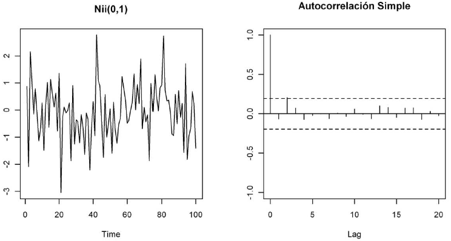
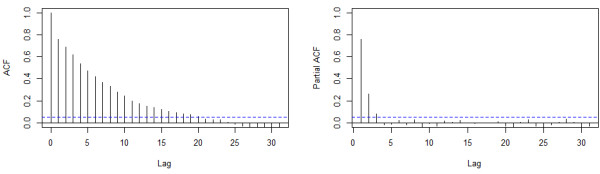
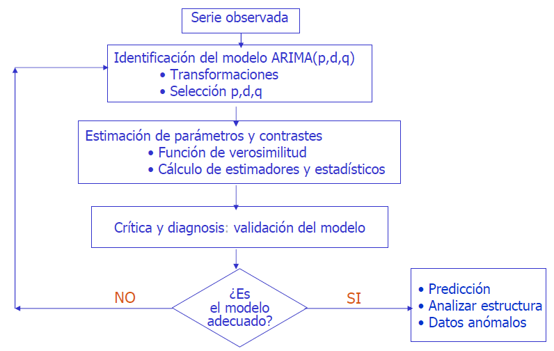

# Series Temporales

Table of Contents
=================

   * [Series Temporales](#series-temporales)
      * [Introducción](#introducción)
      * [Análisis de series temporales univariantes](#análisis-de-series-temporales-univariantes)
      	* [Enfoques](#enfoques)
      		* [Enfoque clásico (descomposición)](#enfoque-clásico)
			* [Enfoque de los Alisados o Suavizados](#enfoque-de-los-alisados-o-suavizados)
			* [Enfoque Box-Jenkins](#enfoque-box-jenkins)
				* [ARIMA](#arima-(autoregresive-integrated-moving-average))
				* [SARIMA](#sarima-(seasonal-autoregresive-integrated-moving-average))
	* [Predicción de series temporales con redes neuronales](#predicción-de-series-temporales-con-redes-neuronales)
      * [Análisis de series temporales multivariantes](#análisis-de-series-temporales-multivariantes)
      	* [Enfoque Box-Jenkins](#enfoque-box-jenkins-1)
			* [VAR](#var)
			* [VEC](#vec)
      * [Manejo de datos perdidos en series temporales](#manejo-de-datos-perdidos-en-series-temporales)			
      * [Series temporales con R](#series-temporales-con-r)
	 * [Series temporales con alisados, arima, etc. con R](#series-temporales-con-alisados-arima-etc-con-r)     
      	 	* [Paquetes R para el análisis y tratamiento de Series Temporales:](#paquetes-r-para-el-análisis-y-tratamiento-de-series-temporales)
	* [Series temporales con redes neuronales con R](#series-temporales-con-redes-neuronales-con-r)
      	 	* [Paquetes R para el análisis y tratamiento de Series Temporales con redes neuronales:](#paquetes-r-para-el-análisis-y-tratamiento-de-series-temporales-con-redes-neuronales)
	* [Imputación de datos perdidos en series temporales con R](#imputación-de-datos-perdidos-en-series-temporales-con-r)
      	 	* [Paquetes R para la imputación de datos perdidos en series Temporales:](#paquetes-r-para-la-imputación-de-datos-perdidos-en-series-temporales)	
	* [Análisis gráfico de series temporales](#análisis-gráfico-de-series-temporales)
      * [Ejemplos de análisis de series temporales](#ejemplos-de-análisis-de-series-temporales)
   * [Cursos relacionados](#cursos-relacionados)
   * [Bibliografía](#bibliografía)

## Introducción

Una serie temporal es una colección de observaciones de una variable tomadas de forma secuencial y ordenada en el tiempo (instantes de tiempo equiespaciados). Las series pueden tener una periodicidad anual, semestral, trimestral, mensual, etc., según los periodos de tiempo en los que están recogidos los datos que la componen. Las series temporales se pueden definir como un caso particular de los procesos estocásticos, ya que un proceso estocástico es una secuencia de variables aleatorias, ordenadas y equidistantes cronológicamente referidas a una característica observable en diferentes momentos.

Algunos ejemplos de series temporales vienen de campos como la economía (producto interior bruto anual, tasa de inflación, tasa de desempleo, ...),  la demografía (nacimientos anuales, tasa de dependencia, ...), la meteorología (temperaturas máximas, medias o mínimas, precipitaciones diarias, ...), etc.

El objetivo de una serie temporal reside en estudiar los cambios en esa variable con respeto al tiempo (descripción), y en predecir sus valores futuros (predicción). Por lo tanto, el análisis de series temporales presenta un conjunto de técnicas estadísticas que permiten extraer las regularidades que se observan en el comportamiento pasado de la variable, para tratar de predecir el comportamiento futuro.

Una serie temporal se representa mediante un gráfico temporal, con el valor de la serie en el eje de ordenadas y los tiempos en el eje de abscisas. Esta es la forma más sencilla de comenzar el análisis de una serie temporal y permite detectar las características y componentes más importantes de una serie. 

**Componentes de una serie temporal**

Los componentes que forman una serie temporal son los siguientes:

- Tendencia: Se puede definir como un cambio a largo plazo que se produce en relación al nivel medio, o el cambio a largo plazo de la media. La tendencia se identifica con un movimiento suave de la serie a largo plazo.
- Estacionalidad: Se puede definir como cierta periodicidad de corto plazo, es decir, cuando se observa en la serie un patrón sistemático que se repite periódicamente (cada año, cada mes, etc., dependiendo de las unidades de tiempo en que vengan recogidos los datos). Por ejemplo, el paro laboral aumenta en general en invierno y disminuye en verano. 
- Ciclo: Similar a la estacionalidad, ya que se puede definir como una fluctuación alrededor de la tendencia, pero de una duración irregular (no estrictamente periódica).
- Irregular: Son factores que aparecen de forma aleatoria y que no responden a un comportamiento sistemático o regular y por tanto no pueden ser predecidos. No se corresponden a la tendencia ni a la estacionalidad ni a los ciclos.

**Tipos de series temporales**

Además, las series temporales se pueden dividir en:

- Estacionarias: es aquella en la que las propiedades estadísticas de la serie son estables, no varían con el tiempo, más en concreto su media, varianza y covarianza se mantienen constantes a lo lardo del tiempo. Si una serie temporal tiene una media constante a lo largo del tiempo, decimos que es estacionaria con respecto a la media. Si tiene varianza constante con respecto al tiempo, decimos que es estacionaria en varianza.
- No estacionarias: son aquellas en las que las propiedades estadísticas de la serie sí varían con el tiempo. Estas series pueden mostrar cambio de varianza, tendencia o efectos estacionales a lo largo del tiempo. Una serie es no estacionaria en media cuando muestra una tendencia, y una serie es no estacionaria en varianza cuando la variabilidad de los datos es diferente a lo largo de la serie.

La importancia de esta división reside en que la estacionaridad (en media y en varianza) es un requisito que debe cumplirse para poder aplicar modelos paramétricos de análisis y predicción de series de datos. Ya que con series estacionarias podemos obtener predicciones fácilmente, debido a que como la media es constante se puede estimar con todos los datos y utilizar este valor para predecir una nueva observación. Y también permite obtener intervalos de confianza para las predicciones. 

Un tipo especial de serie estacionaria es la serie denominada **ruido blanco**. Un ruido blanco es una serie estacionaria tal que ninguna observación influye sobre las siguientes, es decir, donde los valores son independientes e idénticamente distribuidos a lo largo del tiempo con media y covarianza cero e igual varianza.

Otro tipo especial de serie temporal es la llamada **camino aleatorio**, una serie es un camino aleatorio si la primera diferenciación de la serie es un ruido blanco.

Las series temporales también se pueden dividir según cuántas variables se observan o según su variabilidad:

- Univariante: la serie temporal es un conjunto de observaciones sobre una única caracteristica o variable.
- Multivariante: (o vectorial): la serie temporal es un conjunto de observaciones de varias variables.  
 
- Homocedástica: una serie es homocedástica si su variabilidad se mantiene constante a lo largo de la serie.
- Heterocedástica: una serie es heterocedástica cuando la variabilidad de la serie aumenta o disminuye a lo largo del tiempo.

Por otro lado, la variable que se observa en una serie temporal puede ser de tipo:

- Flujo: variable cuya cantidad es acumulada a lo largo del tiempo, por ejemplo: inversión, ahorro, etc.
- Stock: variable cuya cantidad se mide en un determinado momento del tiempo, por ejemplo: población, nº parados, etc.

________________________________________________________________________

## Análisis de series temporales univariantes

La tarea de predicción y análisis de series temporales por lo general consta de cinco pasos básicos (sólo como referencia):

- Definición del problema. A menudo, esta es la parte más difícil de la predicción. 
En la definición del problema se necesita que se comprenda la forma en que se utilizarán las predicciones. Hay que dedicar tiempo para hablar con todas las entidades que van a participar en la recogida de datos, el mantenimiento de bases de datos, y el uso de las predicciones.

- Recopilación de información.
Hay al menos dos tipos de información necesaria:
   1. los datos estadísticos
   2. la experiencia acumulada de las personas (expertos) en los datos y que hacen las predicciones. 
Será difícil obtener suficientes datos históricos para ser capaz de encajar un buen modelo estadístico. Sin embargo, datos historicos antiguos serán menos útiles para la predicción.

- Análisis Preliminar (exploratorio)
Primero, es necesario hacer una representación gráfica de los datos. Y hacerse las siguientes preguntas:
   - ¿Existen patrones? ¿Hay una/alguna tendencia que destaque? ¿Es importante la estacionalidad? ¿Hay presencia los ciclos? ¿Hay algunas anomalías en los datos que puedan ser explicados por expertos (conocimiento experto)? ¿Qué relación tienen las variables que se estudian? 

- Elección y ajuste de modelos.
El mejor modelo a utilizar depende (en la mayoría de los casos) de la disponibilidad de datos históricos, la fuerza de las relaciones entre la variable de predicción y las variables explicativas. Cada modelo es una construcción artificial que se basa en un conjunto de supuestos (explícitos e implícitos) y por lo general consiste en uno o más parámetros que deben ser "equipados" utilizando los datos históricos conocidos. Pra ello: modelos de regresión , los métodos de suavización exponencial, los modelos de Box-Jenkins ARIMA, los modelos dinámicos de regresión, redes neuronales, y vectores autorregresivos, deeplearning, ...

- Uso y evaluación de un modelo de predicción.
Una vez que el modelo ha sido seleccionado y sus parámetros estimados, el modelo se utiliza para hacer predicciones. El rendimiento del modelo sólo puede ser evaluado correctamente después de que los datos para el período de predicción estén disponibles.

## Enfoques

### Enfoque clásico

El análisis más clásico de las series temporales se basa en la idea de que los valores que toma la variable de observación son la consecuencia de las componentes anteriores (tendencia, estacionalidad, ciclo y aleatoriedad), aunque no siempre aparecen todas. Luego este enfoque descriptivo **determinista** consiste en encontrar componentes que se correspondan a una tendencia a largo plazo, un comportamiento estacional y una parte aleatoria. 

El primer paso a seguir a la hora de realizar un análisis es determinar cómo se combinan los componentes de la serie. Para ello se consideran dos modelos habituales para relacionar los valores de la serie con los componentes anteriores:

- Modelo aditivo: donde cada componente contribuye al comportamiento de la variable de interés en forma aditiva (unidades).
- Modelo multiplicativo: donde cada componente contribuye al comportamiento de la variable de interés en forma multiplicativa (porcentaje).

Si a modelo multiplicativo se le aplica un logaritmo para estabilizarlo, entonces es equivalente a un modelo aditivo. Así pues, una serie temporal se puede descomponer y denotar en su manera aditiva como:

Xt = Tt + Et + It

ó en su forma multiplicativa como:

Xt = Tt x Et x It

donde Tt es la tendencia, Et es la componente estacional, que constituyen la señal o parte
determinística, e It es el ruido o parte aleatoria. 

Para conocer qué tipo se adapta mejor a la serie, se pueden seguir los siguientes procedimientos:

- De manera visual:
   - La tendencia y la estacionalidad se mantienen relativamente constantes -> modelo aditivo
   - La tendencia y la estacionalidad varian creciendo o decreciento -> modelo multiplicativo
- De forma matemática:
   - Calcular las series diferencia y cociente, D y C.
   - Calcular el coeficiente de variación para cada serie, CVD y CVC.
   - Comparar sendos coeficientes.
      - Si CVC < CVD -> modelo multiplicativo
      - Si CVC > CVD -> modelo aditivo

Una vez que se conoce la forma en que se relacionan los componentes, se descompone la serie estimando los componentes de tendencia y estacionalidad:

- Componente de tendencia: la forma de la tendencia se puede modelar mediante los siguientes métodos (es importante reseñar que como la finalidad del análisis no es solo describir la serie sino predecir, hay que tener en cuenta cómo continúa la tendencia estimada para valores futuros):
   - Modelos lineales
   - Modelos polinómicos
   - Filtrado (Médias móviles)(no se recomienda ya que no predice, solo describe)
   - Diferenciación (diferencias regulares)
- Componente de estacionalidad: para estimar el efecto estacional se pueden obtener los índices o coeficientes de estacionalidad que representan el valor promedio para cada elemento de la estación (si es anual para cada mes, si es trimestral cada trimestre, esto es, el periodo de la serie)(la suma de los índices estacionales debe de ser igual al número de periodos). Además, la serie original se puede desestacionalizar también mediante una diferenciación estacional de la serie.
   - Médias móviles centradas
   - Diferenciación (diferencias estacionales)

*Se puede diferenciar la parte regular (lag=1) para la tendencia y se puede diferenciar la parte estacional para la estacionalidad (lag=periodo), o ambas. Se seleccionaría aquella diferenciación que minimice la varianza, ya que en una serie sobrediferenciada la varianza aumenta.*

Y por lo tanto, la tendencia y la estacionalidad una vez modelados se pueden eliminar para obtener la componente aleatoria:

It = Xt − Tt − Et

ó

It = Xt / (Tt * Et)

En este punto se tiene una descomposición de la serie en componentes que separan tendencia, estacionalidad y ruido. Estos componentes obtenidos de la serie la describen, pero no la predicen. Las predicciones de valores futuros se consiguen usando las componentes Tt y Et con valores de tiempo t+1, t+2, etc. Para ello se realiza un pronóstico futuro de la tendencia, y se le añade la predicción de la estacionalidad (índice de estacionalidad) correspondiente a cada periodo (la componente irregular o aleatorio no es predecible y por lo tanto no se considera).

**Ventajas e inconvenientes**

Los métodos clásicos de análisis de series temporales tienen la ventaja de no ser excesivamente complejos, ya que explican la evolución pasada de una serie en función de pautas simples pero tienen problemas y limitaciones. Aunque son útiles para describir las pautas que sigue una serie temporal, las predicciones que proporcionan suelen ser muy malas (es decir, con un gran error asociado). La razón de esto es que en una serie temporal la observación más reciente depende, en general, de sus valores pasados, pero esta dependencia suele ser más fuerte con los datos más recientes y más débil con los más alejados. 

### Enfoque de los Alisados o Suavizados

Los métodos de suavizado o alisado se basan en modelos paramétricos **deterministas** que se ajustan a la evolución de la serie. Son técnicas de tipo predictivo más que descriptivo (resultan más adecuados para pronosticar). Estos modelos se pueden emplear en:

**Series temporales sin tendencia ni estacionalidad**

Este tipo de series tienen un comportamiento más o menos estable que sigue un patrón subyacente salvo fluctuaciones aleatorias (comportamiento estacionario), a este tipo de series se le pueden aplicar:

- Modelos "naive" o ingenuos: según la importancia que se le de a las observaciones se tiene:
	- Se otorga la misma importancia a todas las observaciones a la hora de predecir, de esta forma la previsión vendrá dada por la media de las observaciones. 
	- Se da importancia únicamente a la última de las observaciones ignorando el resto, de forma que el ajuste de la serie es su “sombra”, es la misma serie pero retardada en una unidad de periodo.
- Modelos de médias móviles: se basan en considerar únicamente las últimas k observaciones. De esta forma se da el mismo peso a los últimos k datos y nada al resto. Este procedimiento no es tan extremo como los anteriores, y al sustituir cada dato por una media de los k últimos la serie se suaviza y se elimina ruido, obteniendo el patrón subyacente de la misma. Cuantas más observaciones relevantes (k) tomemos al aplicar este tipo de ajuste más se suavizará la serie.
- Modelos de suavizado exponencial simple: consisten en dar importancia a todos los datos anteriores, pero concediéndoles diferentes pesos, ya que los datos más relevantes a la hora de efectuar una previsión son los últimos de los que se dispone, disminuyendo la importancia conforme nos alejamos de ellos. De esta manera se sustituye cada dato de la serie por una media ponderada de las observaciones anteriores, considerando que los pesos de las mismas decaen de forma exponencial conforme éstas se alejan en el tiempo (la fórmula del ajuste es recursiva). La cantidad de alisado (de nivel) depende de un parámetro, alpha, que modula la importancia que tienen las observaciones pasadas sobre el presente. Su valor oscila entre 0 y 1. Si alpha toma un valor próximo a 0 las predicciones a lo largo de la serie son muy similares entre sí, y se modifican poco con la nueva información. El caso extremo se produce cuando alpha es cero, lo que implicaría que la predicción es una constante a lo largo del tiempo. Si alpha, por el contrario, toma un valor próximo a 1 la predicción se va adaptando al último valor observado, por lo que se puede decir que los valores alejados en el tiempo no tienen mucha influencia sobre la predicción. El suavizado exponencial simple es el más similar a un modelo ARIMA con cero órdenes de autorregresión, un orden de diferenciación y un orden de media móvil.

**Series temporales no estacionales con tendencia**

En el caso de series temporales con tendencia lineal (creciente o decreciente) pero sin comportamiento estacional, el modelo clásico que más se suele aplicar es el de Holt:

- Modelos de suavizado exponencial de Holt: en estos modelos se aplican un suavizado exponencial simple de manera doble, por lo que también son conocidos como suavizado exponencial doble (en un principio se alisa directamente a la variable objeto de estudio, mientras que en la segunda operación se procede a alisar a la variable alisada previamente obtenida). Estos modelos dependen de dos parámetros, alpha y beta (suavizado de nivel y de tendencia). El parámetro beta modula la importancia que tienen las observaciones pasadas sobre la pendiente estimada en tiempo t. Al igual que para alpha, los valores de beta oscilan entre 0 y 1. Si beta toma un valor próximo a 0 entonces la pendiente es constante o casi constante, es decir, cambia poco a lo largo de la serie temporal. Si beta toma un valor próximo a 1, la predicción de la pendiente se va adaptando al último valor observado y las observaciones de las pendientes más alejadas en el tiempo no tienen apenas influencia sobre la predicción. El modelo de suavizado exponencial de Holt es muy similar a un modelo ARIMA con cero órdenes de autorregresión, dos órdenes de diferenciación y dos órdenes de media móvil.
	- Modelos de suavizado exponencial de Brown: el modelo de Brown es un caso especial del modelo de Holt, en el que sus parámetros de suavizado son el nivel y la tendencia, pero se asumen iguales. 

**Series temporales con tendencia y estacionalidad**

En el caso de series temporales con tendencia lineal (creciente o decreciente) y comportamiento estacional, el modelo clásico que se aplica es el de Holt-Winters:

- Modelo de Holt-Winters: es una extensión del modelo de Holt, solo que además considera estacionalidad, luego ahora el modelo depende de tres parámetros, alpha, beta y gamma (suavizado de nivel, de tendencia y estacional). El parámetro gamma modula la importancia que tienen las observaciones hechas en el mismo periodo de tiempos pasados sobre la predicción en tiempo t. Gamma oscila entre 0 y 1. Si gamma es 0 la predicción en tiempo t va a tomar un valor constante que va a depender de todas las observaciones pasadas dentro de ese mismo periodo. Si gamma es 1 la prediccion en tiempo t va a depender solamente de la observación hecha en tiempo t-p, siendo p la frecuencia (por ejemplo t = 12 para observaciones mensuales). La tendencia y la estacionalidad se pueden combinar de manera aditiva o multiplicativa (el modelo multiplicativo sería más adecuado cuando la amplitud del ciclo va cambiando en el tiempo). El modelo de suavizado exponencial aditivo de Winters es muy similar a un modelo ARIMA con cero órdenes de autorregresión, un orden de diferenciación, un orden de diferenciación estacional y p+1 órdenes de media móvil, donde p es el número de periodos contenidos en un intervalo estacional. Mientras que el modelo de suavizado exponencial multiplicativo de Winters no es similar a ningún modelo ARIMA.

### Enfoque Box-Jenkins

Hasta ahora se han analizado las series temporales desde un punto de vista determinista o clásico, sin tener en cuenta cuál es el mecanismo que genera la serie. Pero ahora con este nuevo enfoque se analizan desde un punto de vista **estocástico**, por lo que el punto de partida para elaborar un modelo a partir de una serie temporal consiste en considerar que dicha serie está generada y es una realización particular de un proceso estocástico.

Pero para poder efectuar inferencias sobre los parámetros de un proceso estocástico, es preciso imponer restricciones a este último. Las restricciones que se imponen habitualmente son que sea estacionario y ergódico. Ya se ha visto cuándo un proceso es estacionario, pero ¿cúando es ergódico?. Antes de explicar un proceso ergódico necesitamos definir la autocorrelación. Se denomina **autocorrelación** de orden k, pk, a la correlación (dependencia) de cualesquiera dos variables aleatorias del proceso estocástico (serie temporal), distanciadas k instantes de tiempo. Algunas de sus principales caracteristicas son:
- La autocorrelación de periodo k=0 (p0) siempre es 1 por definición.
- La autocorrelación es simétrica pi=p-i
- La autocorrelación siempre es menor que 1 y mayor que -1 (|pk| < 1)

La autocorrelación se puede medir mediante las funciones de autocorrelación:

- Función de autocorrelación simple (ACF): esta función mide la correlación entre dos variables separadas por k periodos. Proporciona la estructura de dependencia lineal de la misma. Así la ACF va a ser una sucesión de valores (p1, p2, ... pk,) que representan cómo influye una observación sobre las siguientes. De forma que p1 denota la influecia de una observación,pi, sobre la siguiente pi+1, p2 representa la influencia de una observación,pi, sobre la de dos periodos posteriores pi+2 y así sucesivamente. Un valor de pi próximo a 1 indica que hay mucha relación entre una observación y la i posiciones posterior, y que esa relación es positiva (si el valor es próximo a -1 que esa relación es negativa).
- Función de autocorrelación parcial (PACF): esta función mide la correlación entre dos variables separadas por k periodos pero cuando no se considera la dependencia creada por los retardos intermedios existentes entre ambas.

Las funciones de **autocorrelación simple y parcial** constituyen uno de los instrumentos clave para ajustar el modelo que genera una serie temporal. Así pues, un proceso es ergódico cuando conforme k se hace más grande, a autocorrelación se hace más pequeña. Es decir, que la dependencia entre variables tiene menos importancia pasado más tiempo.

**ARIMA (AutoRegresive Integrated Moving Average)**

Box y Jenkins desarrollaron modelos estadísticos para series temporales que tienen en cuenta la dependencia existente entre los datos, esto es, cada observación en un momento dado es modelada en función de los valores anteriores. Los modelos se conocen con el nombre genérico de ARIMA (AutoRegresive Integrated Moving Average)(ARIMA para procesos estocásticos no estacionarios y ARMA para procesos estocásticos estacionarios), que deriva de sus tres componentes Autoregresivo, Integrado y Medias Móviles:

- _Procesos Autoregresivos AR(p)_  Los modelos autoregresivos se basan en la idea de que el valor actual de la serie, Xt, puede explicarse o predecirse en función de _p_ valores pasados Xt-1, ... Xt-p más un término de error, donde _p_ determina el número de valores pasados necesarios para pronosticar un valor actual. El orden del modelo expresa el número de observaciones retrasadas de la serie temporal que intervienen en la ecuación, así pues, un modelo autoregresivo de orden 1 AR(1), la variable Xt está determinada únicamente por un valor pasado, esto es Xt-1 y así sucesivamente. Todos los procesos autorregresivos son procesos invertibles. Xt=f0+f1Xt-1+f2Xt-2+......+fpXt-p+at

- _Procesos de Medias Móviles MA(q)_  Un modelo de medias móviles es aquel que explica el valor de una determinada variable en un período _t_ en función de un término independiente y una sucesión de errores correspondientes a períodos precedentes, ponderados convenientemente. Estos modelos se denotan normalmente con las siglas MA, seguidos del orden entre paréntesis. Todos los procesos de medias móviles son procesos estacionarios. No todos los procesos de medias móviles son invertibles. Xt=m+at+q1at-1+q2at-2+......+qpat-p

- _Proceso Autoregresivo de Medias Móviles ARMA(p,q)_   Una extensión natural de los modelos AR(p) y MA(q) es un tipo de modelos que incluyen tanto términos autorregresivos como de medias móviles. Los modelos autorregresivos de medias móviles, ARMA(p,q), son la suma de un proceso autorregresivo de orden _p_ y uno de medias móviles de orden _q_. Es muy probable que una serie de tiempo tenga características de AR y de MA a la vez y, por consiguiente, sea ARMA. Un proceso ARMA(p, q) es estacionario si lo es su componente autorregresiva, y es invertible si lo es su componente de medias móviles.

- _Proceso Integrado I(d)_   No todas las series temporales son estacionarias, algunas presentan cambios de nivel en el tiempo o la varianza no es constante, por lo que la serie se diferencia _d_ veces para hacerla estacionaria. A este tipo de procesos se les considera procesos integrados, y se puede aplicar a esta serie diferenciada un modelo ARMA(p,q) para dar lugar a un modelo ARIMA(p,d,q).

Luego un Proceso Autoregresivo Integrado y de Media Móvil, ARIMA (p,d,q), es una serie de tiempo autoregresiva integrada de media móvil. Donde denota _p_ el número de términos autoregresivos, _d_ el número de veces que la serie debe ser diferenciada para hacerla estacionaria y _q_ el número de términos de la media móvil invertible. La metodología Box-Jenkins para la construcción de los modelos ARIMA(p,d,q) se realiza de manera iterativa mediante un proceso en el que se puede distinguir cuatro etapas:

- **Identificación:** esta primera fase consiste en identificar el posible modelo ARIMA(p,d,q) que sigue la serie (es posible identificar más de un modelo candidato que pueda describir la serie), lo que requiere:

      - Generalmente en primer lugar se debe de representar gráficamente la serie para identificar la tendencia y la estacionalidad (si es que las hay)(la estacionalidad de puede ver con las gráficas de las subsecuencias estacionarias). Posteriormente se prosigue modelando y eliminando tanto la tendencia como la estacionalidad para conseguir la estacionariedad (sobre todo si son muy pronunciadas y se ve claramente que existen)(ya se ha explicado anteriormente cómo se estiman y modelan ambas)(en caso de observarse un componente estacional muy fuerte además de tendencia, se puede probar a eliminar primero el componente estacional por si la serie resultante ya fuera estacionaria, y así no tener que realizar además la eliminación de la tendencia)(también pueden no eliminarse directamente e incluirse las diferenciaciones necesarias para hacerlo en el modelo ARIMA). Aunque en el análisis y modelado de series temporales no hay un patrón fijo a seguir, lo recomendable es llegar al análisis de tendencia y estacionalidad con la serie temporal lo mas limpia posible, eliminando todo tipo de comportamientos no deseados, luego si al graficar la serie vemos claramente que es heterocedástica (no es constante en varianza)(es frecuente observar que la varianza aumenta con el nivel de la serie)(por lo tanto no sigue una distribución normal) es recomendable realizar alguna de las siguientes transformaciones para acercarse más a una distribución normal:
		- Transformación logarítmica: consiste en aplicar a los datos de la serie original un logaritmo de forma. Los valores pequeños se expandirán y los grandes se contraeran. Solo se puede llevar a cabo con valores positivos (aunque esto se soluciona sumando una constante a los valores). Una transformación logaritmica se deshace con una transformación exponencial.
		- Transformación de Box-Cox: al igual que la anterior, son una familia de transformaciones potenciales para corregir sesgos en la distribución de errores, varianzas desiguales y principalmente para corregir la no linealidad en la relación (mejorar correlación entre las variables). La diferencia está en que se emplea e identifica un parámetro lambda que va a representar el mejor valor para elevar los datos que aumenta la normalidad.

      - Una vez esto hecho se comprueba la estacionariedad. La condición de estacionaridad es un requisito que debe cumplirse para poder aplicar modelos paramétricos de análisis y predicción de series de datos. Pero ¿cómo saber si una serie es estacionaria?
		- Gráficamente: Representando y observando las gráficas de autocorrelación (ACF) y autocorrelación parcial (PACF). Como norma general si el ACF tiende “rápidamente” a 0 entonces es estacionaria, cuando la serie no es estacionaria, el ACF decrece lentamente a 0.	
		- Test estadísticos: 
			- Dickey-Fuller Ampliado (Test ADF). La hipótesis nula en este test es que la serie no es estacionaria, luego si el valor resultante, p-value, es menor de 0.05 (ya que el p-value representa la probabilidad de la hipótesis tomada) indica que la serie es estacionaria con un nivel de confianza del 95% (en caso contrario no habría evidencia para rechazar la hipótesis de no estacionariedad). 
			- Kwiatkowski-Phillips-Schmidt-Shin (Test KPSS). En este caso la hipótesis es la contraria, luego un p-value mayor que 0.05 indica que la serie sí es estacionaria.
      
      Si encontramos que la serie no es estacionaria ni habiendo eliminado la tendencia y la estacionalidad, se debe de diferenciar hasta conseguir que lo sea. La parte integrada suele ser necesaria para corregir la estacionaridad en la varianza. Normalmente los ordenes de diferenciación para que desaparezcan la tendencia o estacionalidad que quede no suelen ser elevados. Uno de los errores más comunes es aplicar una difereciación extra de la necesitada por la serie temporal para ser estacionaria, lo que es conocido como **sobrediferenciación**. Un indicio de que una serie temporal ha sido sobrediferenciada, es que el primer rezago de la gráfica de autocorrelación es -0.5 o un valor más negativo. Otro síntoma de sobrediferenciación es un incremento en la desviación estándar (y la varianza) trás aplicar una diferenciación más, luego el orden óptimo de diferenciación es frecuentemente aquel que hace que la desviación estándar (y varianza) sea la más baja posible.   
      - Por último, una vez que la serie sea estacionaria, se determina un modelo ARIMA (o ARMA en caso de que no haga falta diferenciar) para la serie estacionaria, es decir, los órdenes p, d y q de su estructura autorregresiva, integrado y de media móvil. El modelo se puede deducir leyendo los correlogramas de la serie, es decir, las funciones de autocorrelación y autocorelación parcial (de la serie transformada, no de la original), ya que por norma general cuando solo hay un componente:

		- Los modelos AR tienen un ACF que decrece rápidamente a 0 (con diferentes posibles formas: regulares, sinusoidales, anternando +/-). El número del orden “p” (AR(p)) es tantos valores “distintos de 0 como haya en el PACF”.
		- Los modelos MA tiene un PACF que decrece rápidamente a 0 (con diferentes posibles formas: regulares, sinusoidales, anternando +/-)(aunque generalmente no ayuda a establecer el orden). El número del orden “q” (MA(q)) es tantos “valores distintos de 0” como haya en el ACF.
		
		Considerando un valor “distinto de cero” si no está en el rango (-2/sqrt(N), 2/sqrt(N)), con N=longitud de la serie (banda de significancia, suelen ser del 95%). Luego la identificación de los órdenes del modelo consiste en comparar la ACF y PACF estimada de la serie estacionaria con la ACF y PACF de los modelos teóricos. Hay situaciones que no son muy claras, en estos casos puede tratarse de un modelo con las dos partes, la AR y la MA. Estos son modelos ARMA(p,q) o ARIMA(p,0,q). Sus funciones FAS y FAP son combinaciones de las de ambas partes, por lo que son más difíciles de identificar a simple vista. Debido a que en la práctica es difícil identificar con exactitud el orden p y q del modelo ARMA, se pueden plantear dos o más modelos plausibles, que luego de ser estimados son útiles para la elección del más apropiado. 

- **Estimación:** una vez seleccionado provisionalmente un modelo para la serie estacionaria, se pasa a la segunda etapa, donde se estiman los coeficientes/parámetros de los términos autorregresivos (AR) y de media móvil (MA) del modelo (siempre el modelo estacionario, no el original). Los parámetros se suelen obtener por máxima verosimilitud o por mínimos cuadrados lineales, pero en otras ocasiones se recurre a la estimación no lineal de los parámetros, el objetivo en ambos casos es encontrar los valores de los parametros que minimizen el sumatorio de los errores al cuadrado (o dicho de otra forma, minimizar la suma de los cuadrados de los residuos).  

- **Validación:** en esta etapa se busca evaluar si el modelo (o los modelos) estimado(s) se ajusta(n) razonablemente bien a los datos (y si se estimaron varios modelos para conocer cuál es mejor) antes de hacer uso del modelo para la predicción. Así pues la validación o verificación incluye 3 tipos de análisis:

  	- El análisis de los coeficientes o parámetros del modelo: se desea que el modelo estimado cumpla con las condiciones de estacionariedad e invertibilidad y que exista significancia estadística en los rezagos incorporados.
	- La evaluación de la bondad del ajuste: ya que los modelos han sido elegidos mediante identificación, es importante determinar cuál de los modelos presenta una mejor bondad de ajuste.
		- AIC (Akaike Information Criterion): es una medida de la calidad relativa de un modelo estadístico que proporciona un medio para la selección de un modelo entre un conjunto de modelos. El AIC maneja un trade-off entre la bondad de ajuste del modelo y la complejidad del modelo, para ello tiene en cuenta lo bien que el modelo se ajusta a los datos penalizando la complejidad del modelo que puede llevar a un sobreentrenamiento (es decir, un modelo más complejo puede ajustarse mejor a los datos, pero esto puede hacer que el modelo sea peor para datos futuros). Un valor más pequeño del AIC representa un mejor ajuste. 
		- BIC (Bayesian Information Criterion): similar a AIC.
		- Métodos de validación con datos de entrenamiento y test: una práctica común es seleccionar un modelo basándose únicamente en el ajuste del mismo con todos los datos que forman parte de la serie, pero que un modelo se ajuste y reproduzca bien unos datos no significa necesariamente que prediga datos a futuro bien (frecuentemente mientras mejor se ajusta a unos datos, peor predice datos a futuro, lo que es llamado **sobreentrenamiento**), aunque sea un buen indicador de ello. Para evitar esto, se puede dividir la serie en datos de entrenamiento empleados para estimar el modelo, y datos de test empleados para evaluar la predicción del modelo. Emplear este tipo de técnicas se hace más difícil con series temporales ya que los datos no son independientes y hay que tener cuidado al dividir la serie en entrenamiento y test (se recomienda que las observaciones de entrenamiento ocurran temporalmente antes que la de test).		
			- Hold out: se puede emplear cuando la serie temporal es larga, empleando los datos más recientes para servir de datos test (se recomienda al menos un 20% o tantos datos como el periodo que se quiere predecir), mientras que el resto de datos (los más antiguos) se emplean para ajustar el modelo.
			- Validación cruzada (en su variante Leave-one-out): basada en el método rolling forecast origin, se puede emplear con series temporales cortas (por ejemplo en las que no hay suficientes datos para usar como un periodo de test igual al que se pretende predecir) o largas (esta técnica es una variante de la validación cruzada dejando uno fuera y hace un uso más eficiente de los datos disponibles, ya que al eliminar una o varias observaciones no se elimina toda la información asociada a ellas debido a la correlación inherente entre observaciones de una serie temporal)(por contra es más costosa en cómputo y tiempo). Suponiendo que son necesitadas k observaciones para realizar una predicción fiable, entonces el proceso funciona como sigue: se seleccionan las observaciones 1...k+i para entrenamiento y la observación k+i para test. Esto se realiza de manera iterativa para i=1 hasta el número total de observaciones menos k, y se aplican medidas del error de la estimación (por ejemplo el error medio absoluto, el error cuadrático medio, etc.).	

 			Una vez explicados se puede matizar una diferenciación entre ellos, y es que los criterios de información (como AIC o BIC) no realizan una valoración en función de la predicción sino que la valoración se ciñe al ajuste del modelo a los datos observados, mientras que por otro lado los métodos de validación (hold out, validación cruzada) realizan una valoración del modelo con respecto a la predicción futura que se puede realizar a partir de lo aprendido con los datos observados. Cada uno de los métodos anteriores tiene sus ventajas y desventajas, usar un método de validación con datos de entrenamiento y test tiene la ventaja de que puede usarse para comparar predicciones de métodos diferentes (ARIMA, ETS, ...) pero con el coste de tener que usar algunas observaciones para testear. Mientras que los criterios de información tienen la ventaja de que emplean todas las observaciones, pero requieren que los datos de los modelos comparados sean los mismo, es decir, no puede usarse para comparar entre modelos ARIMA y ETS, o entre diferentes diferenciaciones de los modelos ARIMA, etc.	
	- El análisis de los residuos: debe verificarse el supuesto de que los errores del modelo son un proceso puramente aleatorio (media cero, varianza constante y no correlación serial), es decir, no tienen estructura de dependencia (los residuos no deben estar correlacionados el pasado, deben ser independientes los unos de los otros) y siguen un proceso de ruido blanco.
		- Gráficos sobre los residuos. Se pueden pintar diversos gráficos sobre los residuos cuyo propósito es testear la validez de la asumpción de aleatoriedad de los residuos.
			- Diagrama de secuencia de los residuos: el gráfico debe de mostrar unos residuos planos y sin tendencia (media constante en 0) y una dispersión vertical aproximadamente igual a lo largo del eje horizontal (varianza constante).
			- Lag de los residuos: los datos aleatorios no deben exhibir ninguna estructura en este ploteo. Una estructura en este ploteo indica que los residuos no son aleatorios.
			- Histograma de los residuos: el histograma realiza una sumarización gráfica de la distribución de los residuos, debe tener una forma acampanada.
			- Gráfico de probabilidad normal de los residuos: chequea si los residuos están aproximadamente normalmente distribuidos. La idea consiste en representar los datos empíricos observados frente a los datos que se obtendrían en una distribución normal teórica. Si la distribución de la variable es normal, los puntos quedarán cerca de una línea recta (tendrán una forma aproximadamente lineal). Es frecuente observar una mayor variabilidad (separación) en los extremos.	
			- Gráfico Q-Q: Similar al gráfico de probabilidad normal, con la diferencia de que se usa el cuantil de la distribución como eje X.			
							
		- Correlogramas de los residuos. Se evalúa con el correlograma que los errores del modelo no tengan correlación y sean ruido blanco (la ACF y la PACF de un ruido blanco (serie de datos independientes entre sí) tienen todos los coeficientes nulos en teoría, o no significativos en las gráficas al menos para el 95% de los coeficientes estimados). 	
		- Los estadísticos Ljung–Box (y también Box-Pierce) (test de aleatoriedad) (son test de portmanteau). La hipótesis nula para estos test es que los residuos son independientes (es decir, están incorrelacionados). Luego si el p-value obtenido es pequeño indica que no son aleatorios, en cambio, cuanto mayor es su p-valor más evidencia hay de que los residuos son ruido blanco. El nivel mínimo es 0,05, es decir, debe suceder que el p-valor sea mayor que 0,05.
		- Los estadísticos Jarque Bera, Shapiro-Wilk, Kolmogorov-Smirnov, D'Agostino, Lilliefors o Anderson-Darling (test de normalidad, o prueba de normalidad). Presentan como hipótesis nula que los errores se encuentran distribuidos normalmente, luego un p-value menor que 0.05, denotará que la hipótesis se puede rechazar, y los residuos no siguen una distribución normal (el test de Shapiro-Wilk no se recomienda para un conjunto de valores superior a 50).
		
		Para que un modelo sea válido, los diferentes análisis sobre los residuos obtenidos en la estimación serán "ruido blanco". Un ruido blanco es una serie estacionaria en la que ninguna observación depende de las otras y, por tanto, todos los valores de la ACF y la PACF son nulos. El correlograma y el correlograma parcial deben ser muy similares y los valores no deben ser significativamente distintos de cero. Si ésto no es así y los residuos muestran estructura, habrá que realizar una nueva estimación incorporando la estructura más parecida al modelo teórico que podamos intuir y se repiten las etapas anteriores hasta obtener un modelo adecuado.

- **Predicción:** una vez seleccionado el mejor modelo, éste se puede utilizar para conseguir la mejor predicción de los valores a futuro de la serie a partir de su propia historia. ¿Pero cuál es el mejor predictor que se puede aplicar a los datos? El mejor predictor posible será "el que menos se equivoca" o, en términos estadísticos, aquel que minimiza el error cuadrático medio respecto a otro potencial predictor alternativo. A la hora de realizar una predicción con el modelo obtenido, hay dos tipos de estrategias:
	- One-step-ahead prediction: en esta estrategia se emplean los datos que se tienen para predecir el instante de tiempo siguiente. 
	- Multi-step-ahead prediction: en esta estrategia se pretende predecir más de un instante de tiempo siguiente, para ello la predicción se puede emplear directamente (prediciendo todos los valores temporales de una vez) o de manera iterada (predice los instantes de tiempo uno a uno empleando un one-step-ahead de manera repetida).

**SARIMA (Seasonal AutoRegresive Integrated Moving Average)**

En principio se tiene que los modelos ARIMA(p,d,q) vistos anteriormente son modelos no estacionarios (aunque también se pueden ajustar a modelos estacionarios eliminando la estacionalidad previamente como se ha visto), por ello, también existen los modelos estacionales autorregresivos integrados de média móvil ARIMA(p,d,q)(P,D,Q)S (o SARIMA(p,d,q)(P,D,Q)). Aunque la metodología para constuir estos procesos es igual, son útiles sobre todo cuando la serie de tiempo observada tiene intervalos de observación menores a un año ya que entonces es frecuente que estas tengan variaciones ó patrones sistemáticos cada cierto periodo. Esta estacionalidad debe ser captadas e incluida dentro de la estructura del modelo a construir. Este tipo de procesos tiene las siguientes características:

- Contiene una componente ARIMA(p,d,q) que modela la dependencia regular, que es la dependencia asociada a observaciones consecutivas.
- Contiene una componente ARIMA(P,D,Q) que modela la dependencia estacional, que está asociada a observaciones separadas por periodos.

En principio la parte estacional se puede modelizar de la misma forma que la parte regular. La identificación se realiza estudiando la ACF y la PACF en los retardos estacionales. Cuando una serie tiene parte regular y parte estacional, la FAS presenta una interrelación entre ellas. Básicamente la ACF y PACF de los modelos estacionales presentan las siguientes características:

- ACF: en los primeros rezagos se observa únicamente la parte regular, mientras que la parte estacional se observa en los retardos del orden del periodo (12, 24, etc.). También se puede observar la interacción entre ambos, mediante una componente regular en los retardos cercanos a los estacionales.
- PACF: nuevamente en los primeros rezagos se observa únicamente la parte regular, mientras que la parte estacional se observa en los retardos del orden del periodo (12, 24, etc.). Nuevamente se puede observar la interacción entre ambos, mediante una componente regular en los retardos cercanos a los estacionales (positiva o negativa a la derecha y positiva a la izquierda).

Por ejemplo, un modelo ARIMA(0,0,0)(0,0,1)12 mostraría únicamente una barra significativa en el rezago 12 de la ACF, mientras que la PACF mostraría un decaimiento exponencial en el rezago estacionario. De manera similar, un ARIMA(0,0,0)(1,0,0)12 mostraría un decaimiento exponencial en los rezagos estacionales de la ACF, y una sola barra significativa en el rezago 12 del PACF.

**Ventajas e inconvenientes**

Por último, una de las desventajas de los modelos de Box-Jenkins está en que asumen que las observaciones están presentes en cada periodo de tiempo (ya que son necesarios para el cómputo de las autocorrelaciones), algo que no siempre es así ya que es habitual encontrar series de tiempo con valores perdidos. Por lo que este tipo de series requiere que se apliquen previamente métodos que estimen los valores faltantes para poder emplear el método ARIMA.

________________________________________________________________________

## Predicción de series temporales con redes neuronales

Hasta ahora, los enfoques de análisis de series temporales se han llevado a cabo desde un punto de vista lineal, ya que con los métodos vistos anteriormente se obtienen resultados satisfactorios en series de tiempo lineales, pero al utilizarlos en series no lineales, presentan limitaciones ya que no son capaces de capturar las relaciones no lineales de los datos. Así entran en juego los métodos capaces de capturar las relaciones lineales y no lineales entre los datos, como son las **redes neuronales**.

Los métodos de predicción basados en redes neuronales artificiales están basados en modelos matemáticos simples del cerebro. Una red neuronal puede ser vista como una red de neuronas organizadas en capas, en la que los predictores (o entradas) forman la capa más baja y las predicciones (salidas) forman la capa más alta. Entre ambas capas pueden existir capas intermedias con neuronas ocultas. Esta capa intermedia oculta es la que permite una relación no linear entre las entradas y las salidas permitiendo al modelo más grados de libertad (ya que se emplean funciones no lineales, como la función sigmoide)(si solo se tuvieran la capa de entrada y salida sería una regresión lineal (modelo más simple)). Para aquellas redes que usen funciones como por ejemplo la sigmoide, una **normalización** de los datos es frecuentemente de ayuda, ya que si no se realiza la normalización los datos de entrada tendrán un efecto adicional sobre la neurona, dando lugar a decisiones incorrectas. Entre los tipos de normalización más comunes se pueden encontrar:
- min-max: reescala los valores de los datos entre el rango 0 y 1 (-1 y 1), correspondiéndose el valor mayor de los datos a 1, y el menor a 0.
- z-score: los datos son escalados para tener una media de 0 y una desviación estándar de 1 (μ = 0 y σ = 1), se obtiene restando a cada elemento la media de la población y dividiendolo entre la desviación estándar de la población, y cada valor representa el número de desviaciones estándar que está por encima o por debajo de la media.
- decimal scaling: normaliza los datos moviendo el punto decimal. El número de movimientos del punto decimal para los datos viene dado por valor máximo absoluto de los datos.

Los nodos de cada capa están conectados con otros nodos o incluso consigo mismos, cada conexión es diferente ya que tiene un peso asociado que se actualiza mediante algoritmos de entrenamiento sobre los datos observados que minimizan una función de coste, por lo que van a representar el conocimiento de la red. En un principio los pesos son inicializados aleatoriamente, luego hay una componente aleatoria asociada a cada red neuronal. Dependiendo de la arquitectura e interconexión de todas las neuronas de una red, pueden clasificárse en distintas categorías:  

- Redes neuronales Feed-Forward: es la red neuronal más sencilla, en estos modelos multicapa las salidas de cada capa son las entradas de la capa siguiente, luego la información se mueve solo en una dirección, hacia delante desde las entradas hasta las salidas pasando por las capas ocultas, y por lo tanto no hay ciclos. Su desempeño es bueno para aplicaciones en las que no se requiera que la red retenga información de eventos pasados como ayuda para evaluar eventos futuros. 
- Redes neuronales parcialmente recurrentes: son redes multicapa con algunas conexiones recurrentes, de forma que son una mejora de las redes neuronales Feed-Forward al incluir retroalimentación, pero no llegan a ser completamente recurrentes. En estas redes generalmente existen en la capa de entrada ciertas neuronas especiales (neuronas de contexto) receptoras de las conexiones recurrentes, mientras que el resto de las neuronas actúan como receptores de los datos de entrada. Las redes neuronales parcialmente recurrentes más conocidas son:
	- La red de Jordan: las neuronas de contexto reciben una copia de las neuronas de salida y de ellas mismas, acumulando así las salidas de la red para todos los instantes anteriores.
	- La red de Elman: las neuronas de contexto reciben una copia de las neuronas ocultas de la red.
- Redes neuronales recurrentes: es un tipo de red neuronal en la que no solo las salidas de cada capa son las entradas de la capa siguiente sino que además se puede formas ciclos entre las capas, ya que una neurona se puede conectar con si misma o con otra neurona de la misma capa o incluso con neuronas de la capa anterior (tienen caminos de retroalimentación entre todos los elementos que las conforman). Luego estas redes neuronales recurrentes son más eficaces para resolver problemas con no-linealidades temporales significativas ya que pueden mantener información pasada, lo que está intimamente ligado con secuencias de tiempo por ejemplo. El problema de estas redes reside en que funcionan bien cuándo la información que se pretende mantener es muy cercana, pero no funcionan tan bien cuándo la información es lejana, esto es así ya que la influencia de las entradas pasadas decaen rapidamente con el tiempo. Aquí es dónde aparece un tipo especial de red neuronal recurrente que puede resolver el problema:
	- Redes neuronales Long-Short Term Memory: son capaces de aprender las dependencias largas ya que han sido especialmente diseñadas para ello (usan celdas de memoria), y funcionan muy bien en una gran variedad de problemas.

Con respecto a las series temporales, la idea base reside en que los valores futuros son dependientes de los valores pasados, es decir, buscando en los valores pasados de una serie temporal se puede predecir su comportamiento en el futuro. Luego los valores de los rezagos de las series temporales pueden ser usados como entradas a una red neuronal, de igual modo que se usan en un modelo autoregresivo lineal, y los valores futuros a predecir como las salidas de la red. La aplicación de redes neuronales artificiales a la predicción de series temporales se puede realizar de acuerdo a una serie de etapas que pueden ser: 

- Búsqueda de las variables de entrada: tiene como objetivo identificar los retrasos o rezagos de la serie que deben considerarse como variables de entrada en la red neuronal. Para ello se pueden emplear algunos de los análisis tradicionales de series temporales para estimar la dependencia entre los datos, como son las funciones de autocorrelación simple y parcial, etc. Así se pueden obtener el número de rezagos significativos de la parte regular y de la parte estacional.
- Planteamiento de varias redes neuronales tentativas: tiene como objetivo determinar varias arquitectura de la red con diferentes parámetros de entrada como pueden ser el número de rezagos significativos o nº de neuronas de la capa oculta (también se puede transformar o diferenciar la serie (luego se desharán los cambios)). Aquí es importante reseñar que la serie (o los rezagos) que se le pasa a la red neuronal como entrada no tiene la necesidad de ser estacionaria como sí ocurría en los modelos ARIMA.
- Entrenamiento y test (validación): se dividen los datos disponibles en datos de entrenamiento y datos de test para validar la red neuronal (mediante hold-out, validación cruzada, etc.). Se entrenan los diversos modelos de redes neuronales planteados (mediante  algoritmos de entrenamiento como por ejemplo back-propagation, etc.) para ajustar los parámetros con los datos de entrenamiento, y se testean con los datos de test para ver cuál de ellos ofrece un mejor rendimiento minimizando el error de predicción (el error de predicción se mide por ejemplo mediante el error medio absoluto, el error cuadrático medio, etc.). 

- Predicción: se realiza la predicción con el modelo que la fase anterior haya determinado como el mejor. 

**Ventajas y desventajas**

Los modelos no lineales son más potentes, pero por contra necesitan de más datos de entrenamiento, de más parámetros por ajustar, y se comportan peor (por ejemplo son más dados a producir sobreentrenamiento, etc...). Además, su computación es más pesada lo que va a conllevar un mayor tiempo de cómputo.

________________________________________________________________________

## Análisis de series temporales multivariantes

Los modelos vistos hasta ahora, constituyen una modelización univariante de una serie temporal (útiles para conocer las características de una serie temporal de tendencia, ciclo, estacionalidad, o para predecir), pero no tienen en cuenta la interrelación entre distintas variables (variable objeto de estudio con otras variables relevantes), y por lo tanto su utilidad puede verse limitada. Esta necesidad del estudio interrelacional entre variables se hace latente en muchos ámbitos, un ejemplo de esta necesidad se refleja en el ámbito económico, ya que por ejemplo la realidad económica de sectores, países, empresas, o el conjunto de la economía mundial viene determinada porque sus variables económicas se determinan por la interrelación entre distintas variables, así por ejemplo las ventas de una empresa están en relación con la renta de los consumidores, o la demanda de turistas está en relación con el crecimiento del PIB o de los precios relativos, etc.

Para resolver estas limitaciones se presentan los modelos multivariantes, que son modelos que sí tienen en cuenta la interrelación entre variables de distintas series temporales, luego estos modelos contienen varias series temporales. Concretamente estudian la relación entre una variable de interés y una serie de variables explicativas (que influyen en la variable de interés). En el marco multivariante se considera el pasado tanto de la variable que se quiere explicar, como el de las variables que están relacionadas con dicha variable. Los modelos multivariantes de series temporales son una generalización de los modelos univariantes, la diferencia está en que en vez de una sola variable hay n variables (en vez de una serie, hay varias series). 

## Enfoque Box-Jenkins

La forma multivariante de los modelos ARIMA Box-Jenkins es llamada modelos VARMA o ARMAV (AutoRegressive Moving Average Vector) (VARIMA o ARIMAV). Sin embargo, el ajuste de este tipo modelos es bastante complicado, lo que hace que por simplicidad una de las formas más frecuentes de modelar modelos multivariantes sea como vectores autoregresivos:

**VAR**

Los modelos de **vectores autoregresivos**, VAR, son unos de los modelos más empleados para el análisis de series de tiempo multivariantes. Los modelos VAR son una extensión de los modelos AR, con la diferencia de que mientras que los modelos autorregresivos univariantes recogen la dinámica de una sola serie temporal, los modelos multivariantes recogen las estructuras dinámicas sobre varias series temporales (por lo que presentan tantas ecuaciones como series haya). Dicha estructura consiste en un sistema de ecuaciones en la que cada una representa una función lineal de los rezagos pasados de la variable (como en un modelo AR) y los rezagos de las demás variables de las otras series (no se distingue entre variables endógenas y exógenas). Por ejemplo, si un modelo AR(p) venía dado por la expresión: yt=f0+f1yt-1+f2yt-2+......+fpyt-p+at, ahora se tiene que en lugar de modelar el comportamiento de una variable, modelamos el de k variables, es decir consideremos un vector columna de k variables aleatorias: Yt=[y1, y2, ... , yk]. Luego la expresión general de un modelo VAR viene dada por: 

yt=f1yt-1+f2yt-2+......+fpyt-p+gxt+at

Donde yt es la variable objeto de predicción (vector de variables a predecir), xt es un vector de k variables explicativas, y f y g son los vectores de coeficientes a estimar, con a como el vector de perturbaciones aleatorias. Esta estructura es propicia para ser representada en forma matricial, y es fácilmente extendible para contener un número mayor de series y de rezagos. El número de rezagos empleado viene denotado por el componente p de VAR(p).

Al igual que con los modelos univariantes, existe una metodología para la construcción de los modelos multivariantes:
- Se necesita que las series temporales que forman el modelo multivariante sean estacionarias (una serie temporal multivariante es estacionaria si todas las series temporales que la componen son estacionarias), para ello se pueden emplear las mismas técnicas para comprobar la estacionariedad (gráficas de las funciones de autocorrelación, test de estacionariedad, etc.), y también para conseguir que sea estacionaria (diferenciación).
- Se necesita identificar el modelo VAR(p) que sigue la serie (longitud de retardos seleccionados), para ello se tiene que determinar el orden más apropiado para el modelo, lo que se puede hacer de la misma manera que en las series univariantes (extensiones multivariantes del AIC, BIC, HQ, etc.)(Puede ser el caso que este conjunto de pruebas estadísticas no dejen una dirección clara, entonces se tiene que se ha demostrado que los criterios BIC y HQ proporcionan estimaciones consistentes del verdadero orden del retardo, mientras que AIC sobreestima el orden del retardo con una alta probabilidad).
- Se estiman ecuación a ecuación como una serie univariante aplicando MCO transformado matricialmente para un sistema de ecuaciones.
- Se necesita validar el modelo multivariante elegido, para ello es crucial que los residuos cumplan la asunción de ser ruidos blancos multivariantes. Se destaca aquí los test de Portmanteau que prueban que los residuos están incorrelacionados.
- La predicción con modelos VAR es una extensión de la predicción con modelos AR.

**VEC**

En los modelos VAR, así como en la modelización univariante de series temporales, se asume que las series temporales utilizadas son estacionarias, esto debe de ser así ya que cuando se efectúan regresiones entre variables no estacionarias podemos caer en el problema de las llamadas correlaciones espurias (estimaciones de modelos que presentan en principio buenas validaciones, pero que encierran relaciones no-reales). Aunque en general la regresión entre series no estacionarias conduce a correlaciones espurias, existe una situación especial en el que tal regresión no sería espuria, sino que el estimador MCO sería correcto. Esa situación especial recibe el nombre de **cointegración** (Por definición, una combinación lineal de dos o más series no estacionarias puede ser estacionaria. Luego si existe una combinación lineal de series que es estacionaria, se dice que las series no estacionarias, con raíz unitaria, que dan lugar a esa combinación están cointegradas). La combinación lineal estacionaria se denomina ecuación de cointegración y puede interpretarse como la relación de equilibrio a largo plazo entre las distintas variables que conforman la ecuación por lo cual, en sí misma, tiene una alta importancia para el análisis de los fenómenos que la serie contiene.

Pues bien, un modelo de **vector de corrección del error** (VEC)(VECM, Vector Error Correction Models) es un modelo VAR restringido (habitualmente con sólo dos variables) que tiene restricciones de cointegración incluidas en su especificación, por lo que se diseña para ser utilizado con series que no son estacionarias pero de las que se sabe que son cointegradas. El principio detrás de estos modelos es que existe una relación de equilibrio a largo plazo entre variables y que, sin embargo, en el corto plazo puede haber desequilibrios. Con los modelos de corrección del error, una proporción del desequilibrio de un período es corregido gradualmente a través de ajustes parciales en el corto plazo. Una de las claves de los modelos VEC es determinar si las series que se modelan son cointegradas y, si es así, determinar la ecuación de integración. Para ello se utiliza el método de Johansen (luego si la serie multivariante es cointegrada se utiliza un modelo VEC, si no es cointegrada se utiliza un modelo VAR).

________________________________________________________________________

## Manejo de datos perdidos en series temporales

En el desarrollo teórico de la mayoría de técnicas y modelos no se tienen en cuenta algunas cuestiones que surgen en su aplicación práctica, como es en concreto la existencia de datos faltantes, también denominados perdidos o incompletos. Muchas series temporales existentes contienen valores perdidos o no presentes en las observaciones que las componen (ya sean provocados por mediciones incorrectas, errores, etc). Estos valores perdidos crean numerosos problemas y hacen dificil el análisis de los datos, por lo tanto su presencia hace que sea necesaria una etapa de preprocesado de la serie. Los modelos de pérdida de datos se clasifican en tres tipos diferentes: MCAR, MAR y MNAR. Conocer esta causa que genera los datos perdidos es importante ya que puede ser de ayuda a la hora de seleccionar un método concreto para tratarlos.

La manera más simple de tratar con ellos es descartándolos, pero esto solo es posible cuándo son muy pocos los valores perdidos y no tienen influencia en el análisis posterior. Otra forma de lidiar con ellos es realizar el análisis únicamente con los datos disponibles. Pero uno de los métodos más conocidos para tratar con este problema es la imputación.

**Imputación** 

En estadística, la imputación es el proceso de reemplazar los valores perdidos con valores sustitutos. El objetivo de la imputación es rellenar los valores perdidos con estimaciones (realizadas con el método de aprendizaje más apropiado para cada caso) de estos teniendo en cuenta las relaciones posibles entre las observaciones. Luego existen diversos métodos de imputación diferenciados en la forma de estimar los datos faltantes, cuya elección preferible vendrá dada por la naturaleza de la serie:

- Métodos de imputación simples
	- Imputación mediante la media: se reemplazan los valores perdidos por la media de los valores observados.
	- Imputación mediante regresión: se estima una regresión de las observaciones existentes y se imputa cada valor perdido mediante la ecuación de regresión estimada.
	- Imputación mediante regresión estocástica: similar al enterior pero se imputa añadiendo a la predicción un valor residual para reestablecer la pérdida de variabilidad.
	- Imputación mediante médias móviles: se reemplazan las observaciones faltantes por los valores estimados mediante médias móviles.
	- Imputación por Last Observation Carried Forward (locf): reemplaza el dato perdido por la observacion que le precede. 
	- Imputación por interpolación: se estiman los valores perdidos interpolando (uniendo de manera lineal, polinomial, etc.) el último valor válido antes del valor perdido y el primer valor válido después del valor perdido.	
- Métodos de imputación basados en máxima verosimilitud
	- Imputación múltiple: consiste en realizar varias imputaciones de las observaciones faltantes para luego analizar los conjuntos de datos completados y combinar los resultados obtenidos para obtener una estimacion final. El análisis de imputación múltiple esta dividido en tres fases: fase de imputacion, fase de análisis y fase de puesta en común. 
	- Imputación mediante el algoritmo EM (Expectation-Maximization): es un algoritmo importante para el análisis de datos faltantes. Es un método iterativo de dos pasos (esperanza y maximizacion) donde se comienza por reemplazar los datos ausentes por unos valores estimados y a continuación se procede a una primera estimación de los parámetros, para con estos parámetros volver a iniciar al primer paso y así sucesivamente hasta que la convergencia de los parámetros sea aceptable. 
- Métodos de imputación basados en machine learning
	- Imputación con K-Nearest Neighbor: se estiman los valores peridos con la media de los vecinos seleccionados.
	- Imputación con K-means
	- Imputación con máquinas de soporte vectorial

En el ámbito de la imputación, la imputación en series temporales univariantes es un reto adicional, debido a que la mayoría de algoritmos complejos están desarrollados para series temporales multivariantes ya que dependen de la correlación entre los inter-atributos para estimar los valores de los datos perdidos (imputación múltiple, EM, kNN, etc.), algo que no ocurre en el caso univariante (al ser un único atributo). Pero además de los métodos simples, también hay posibilidades adicionales más complejas para la imputación en series temporales univariantes:
- Algoritmos multivariantes con datos retardados: consisten en emplear indirectamente los algoritmos de series multivariantes en series univariantes empleando el tiempo (variable implícita de una serie temporal) como un atributo más. La forma habitual de hacer esto es mediante lags (variables que toman el valor de otra variable en un instante de tiempo previo) y leads (toman el valor de otra variable en un instante de tiempo posterior).
- Filtro de Kalman con modelos ARIMA de espacio de estados: todos los modelos ARIMA pueden ser reescritos (y estimados) como modelos en el espacio de estados. Estos modelos en el espacio de estados pueden entre otras muchas cosas estimar observaciones perdidas. Luego los principales beneficios de representar sistemas dinámicos en forma de espacio de estados es que el espacio de estados permite que las variables no observadas puedan ser incorporadas y estimadas junto con el modelo observable, y que además, estos modelos en el espacio de estados pueden ser analizados usando un algoritmo recursivo llamado filtro de Kalman (Kalman filter), que es usado, entre otras cosas, para determinar las estimaciones óptimas de los modelos en el espacio de estados.

________________________________________________________________________

## Series temporales con R

## Series temporales con alisados, arima, etc. con R

**Series temporales univariantes**

Para que R trate a un conjunto de datos como serie temporal:

	ts(data, start, end, frequency)

		- data: vector o matrix con las observaciones
		- start: tiempo de la primera observación
		- end: tiempo de la última observación
		- frequency: número de observaciones por unidad de tiempo

Conocer el tiempo de comienzo de la serie:

	start(serie temporal)

Conocer el tiempo de fin de la serie:

	end(serie temporal)

Conocer la frecuencia de la serie:

	frequency(serie temporal)

Representación gráfica de la serie:

	plot(serie temporal) *llama internamente a plot.ts(serie temporal)*

Representación numérica de la serie:

	print(serie temporal)
   
Unidad de tiempo a la que pertenece cada observación de la serie:

	cycle(serie temporal)

Obtener un subconjunto de la serie teporal (puede ser interesante por ejemplo para pintar un año y ver si presenta componente estacional):

	window(serie temporal, start, end)

		- start: tiempo de la primera observación
		- end: tiempo de la última observación

Extraer las subseries estacionales de la serie y pintarlas todas juntas (es interesante para ver la componente estacional)(lo ideal es usarlas sin la componente tendecia):

	monthplot(serie temporal, phase)
	
		- phase: indica la estación a la que corresponde cada muestra

	boxplot(formula, serie temporal)
	
		- formula: fórmula que indica la serie temporal y su división en ciclos (es decir, a que estación o ciclo corresponde cada muestra)

Agregación de los datos de la serie temporal (puede ser interesante por ejemplo para cambiar la frecuencia de anual a trimestral)(siempre que los datos sean agregables):

	aggregate(serie temporal, FUN, nfrequency)
	
		-FUN: función con la que se computa la agregación (mean)
		-nfrequency: nuevo número de observaciones por unidad de tiempo (12->mensual, 4->trimestral, 1->anual...)

Retardar la serie temporal:

	lag(serie temporal, k) *paquete stat* *realiza un rezago del tiempo de la serie temporal*	
	lag(serie temporal, k) *paquete quantmod* *si se le pasa una serie temporal realiza un rezago del tiempo de la serie temporal, si no, realiza un rezago de los datos añadiento un  valor NA al principio*
	
		- k: número de rezagos aplicados a la serie

Descomposición de una serie temporal en Tendencia + Efecto estacional + Residuos:

	decompose(serie temporal, type) *mediante medias móviles*

		- type: tipo de serie, aditiva o multiplicativa
		
	stl(serie temporal, s.windows) *mediante loess*
                
        	- s.windows: establecido con "period" o con el periodo para la extracción de la estacionalidad

Transformación logarítmica de una serie:

	log(serie temporal, base)
		
		- base: base del logaritmo. 10 por defecto
		
Transformación BoxCox de una serie:

	BoxCox(serie temporal, lambda)
	
		- lambda: parámetro de la transformación, el parámetro óptimo para los datos se consigue con la función BoxCox.lambda(serie temporal, method=c("loglik","guerrero"))

Cómputo de las estimaciones de las funciones de autocorrelación y autocorrelación parcial:

	acf(serie temporal, lag.max) *paquete stats*
	Acf(serie temporal, lag.max) *paqute forecast*
	
	pacf(serie temporal, lag.max) *paquete stats*
	Pacf(serie temporal, lag.max) *paqute forecast*	
	
		- lag.max: número máximo de retardos calculados

Cálculo del test de Dickey-Fuller Ampliado (Test ADF) para estacionariedad:

	adf.test(serie temporal) *paquete tseries* *siempre elimina la tendencia de la serie evaluada*
	
	adfTest(serie temporal, type) *paquete fUnitRoots*
	
		type: tipo de regresión de raíz unitaria empleada. "nc" sin intercepto ni tendencia, "c" sin tendencia con intercept, "ct" con intercepto y tendencia
	
Cálculo del test de Kwiatkowski-Phillips-Schmidt-Shin (Test KPSS) para estacionariedad:

	kpss.test(serie temporal)

Cálculo de la tendencia mediante modelos lineales y polinómicos:

    lm(formula)

        - formula: 
            - Para modelos lineales: serie temporal ~ tiempo  
            - Para modelos polinómicos: serie temporal ~ tiempo + I(tiempo^2) + ... 

Cálculo de la tendencia mediante filtrado (medias móviles):

    filter(serie temporal, filter, method, sides)
    
    	- filter: vector de coeficientes del filtro
		- method: "convolution" para usar medias móviles
		- sides: "2" para centrados
	
    decompose(sertie temporal)$trend
    
    ma(serie temporal, order, centre) *paquete forecast*
    
    	- order: orden la media móvil
	- centre: si se desea centrar la media móvil sea cual sea el orden

Eliminación de la tendencia mediante diferenciación (lag=1):

    diff(serie temporal)

Eliminación de la estacionalidad mediante diferenciación del orden del periodo:

    diff(serie temporal, lag)
    
       - lag: retardo a emplear
       
La diferenciación se puede deshacer con:

    diffinv(serie temporal, lag)

       - lag: retardo empleado
       
Cálculo del número de diferenciaciones regulares necesarias para hacer la serie estacionaria:

    ndiffs(serie temporal, test)

		- test: tipo de test con el que se realiza el cálculo; "adf" (Augmented Dickey-Fuller), "kpss", "pp" (Phillips-Perron)
		
Cálculo del número de diferenciaciones estacionales necesarias para hacer la serie estacionaria:

    nsdiffs(serie temporal, m)

		- m: longitud del periodo estacional

Cálculo (identificación) automático del mejor modelo ARIMA al que se ajustan los datos (se puede usar por ejemplo simplemente como una primera aproximación): 

	auto.arima(serie temporal, seasonal, stepwise, d, D)
	
		- seasonal: con true o false indicamos si las búsqueda restringuen el componente estacional
		- stepwise: a FALSE realiza una búsqueda sobre todos los modelos (lento), a TRUE hace una búsqueda gradual (rápido)
		- d: orden de la primera diferenciación regular
		- D: orden de la diferenciación estacional

Simulación de un modelo ARIMA:

	arima.sim(model, n) 
	
		- model: lista con los componenetes AR y MA, se puede usar también _order_ para el orden
		- n: longitud de la serie que se simula

Ajuste del modelo ARIMA sobre una serie temporal:

	arima(serie temporal, order, seasonal) *paquete stats*
	Arima(serie temporal, order, seasonal,lambda)  *permite una componente de tendencia* *paquete forecast*

		- order: especificación de los tres componentes del modelo en forma de vector
		- seasonal: especificación de la parte estacional del modelo junto con el periodo (si la serie original es estacionaria)
		- lambda: si está presente indica el valor que debe de emplear una transformación de BoxCox sobre los datos
		
Ajuste de un modelo autorregresivo AR sobre una serie temporal:

	ar(serie temporal, order.max, method)
	
		- order.max: orden máximo del modelo a ajustar
		- method: método con el que se ajusta el modelo

Evaluación de la bondad del ajuste de varios modelos mediante el criterio AIC (Akaike Information Criterion) o BIC (Bayesian Information Criterion):

	AIC(object, object, ...)
	BIC(object, object, ...)

		- object: modelos de serie temporal que se quieren comparar

Test de Ljung-Box y Box-Pierce para la hipótesis de independencia: 

	Box.test(residuos modelo,type)
	
		- type: "Ljung-Box" o "Box-Pierce" (por defecto)

Test de normalidad con los estadísticos Jarque Bera y Shapiro-Wilk:

	jarque.bera.test(residuos modelo)
	shapiro.test(residuos modelo)

Predecir una serie temporal:

	forecast(object, h)

		- object: modelo de serie temporal
		- h: número de periodos a predecir

	predict(object, n.ahead)

		- object: modelo de serie temporal
		- n.ahead: número de periodos a predecir

Medición de la afinidad del modelo predicho (Error medio (ME), Error medio absoluto (MAE), Porcentaje del error medio absoluto (MAPE), Error medio absoluto escalado (MASE), Porcentaje del error medio (MPE), etc.):

	accuray(object, x)
	
		- object: objeto de la clase forecast (también sirve con arima) o un vector numérico con las predicciones
		- x: vector con los valores reales a comparar

Ajustar una serie temporal mediante un alisado exponencial simple:

	HoltWinters(serie temporal, alpha, beta, gamma) *paquete stats*
	
		- alpha: parámetro alpha del alisado exponencial
		- beta: parámetro beta del alisado exponencial. Debe establecerse a FALSE
		- gamma: parámetro gamma del alisado exponencial. Debe establecerse a FALSE
		
	ses(serie temporal, alpha, h) *paquete forecast*
	
		- alpha: parámetro alpha del alisado exponencial
		- h: nº de periodos a predecir
		
Ajustar una serie temporal mediante un alisado exponencial doble:

	HoltWinters(serie temporal, alpha, beta, gamma) *paquete stats*
	
		- alpha: parámetro alpha del alisado exponencial
		- beta: parámetro beta del alisado exponencial
		- gamma: parámetro gamma del alisado exponencial. Debe establecerse a FALSE

	holt(serie temporal, alpha, beta, h, exponential, damped) *paquete forecast*
	
		- alpha: parámetro alpha del alisado exponencial
		- beta: parámetro beta del alisado exponencial
		- h: nº de periodos a predecir
		- exponential: a TRUE se calcula una tendencia exponencial, a FALSE lineal
		- damped: a TRUE para no usar una tendencia lineal

Ajustar una serie temporal mediante un alisado exponencial Holt-Winter:

	HoltWinters(serie temporal, alpha, beta, gamma, seasonal) *paquete stats*
	
		- alpha: parámetro alpha del alisado exponencial
		- beta: parámetro beta del alisado exponencial
		- gamma: parámetro gamma del alisado exponencial
		- seasonal: permite diferenciar entre un modelo aditivo o multiplicativo. Solo disponible si está presente el parámetro gamma

	hw(serie temporal, alpha, beta, gamma, seasonal, h, exponential, damped) *paquete forecast*
	
		- alpha: parámetro alpha del alisado exponencial
		- beta: parámetro beta del alisado exponencial
		- gamma: parámetro gamma del alisado exponencial
		- seasonal: permite diferenciar entre un modelo aditivo o multiplicativo
		- h: nº de periodos a predecir
		- exponential: a TRUE se calcula una tendencia exponencial, a FALSE lineal
		- damped: a TRUE para no usar una tendencia lineal

Predicción de valores de una serie temporal ajustada con un alisado:

	forecast(object, h) *forecast.HoltWinters()*

		- object: modelo de serie temporal
		- h: número de periodos a predecir

	predict(object, n.ahead) *predict.HoltWinters*

		- object: modelo de serie temporal
		- n.ahead: número de periodos a predecir

Ajuste de una serie temporal aditiva (con tendencia no lineal y estacionalidad semanal y anual)(buena con periodicidad diaria):

	prophet(df)
	
		- df: data.frame con una columna ds con el tiempo, y otra columna y con las observaciones
	
Extensión del data.frame de la serie temporal aditiva con los periodos temporales a predecir:	

	make_future_dataframe(m, periods, freq)
	
		- m: objeto prophet
		- periods: nº de periodos que se va a predecir
		- freq: frecuencia de la serie 
		
Predicción de la serie temporal aditiva:
	
	predict(object, df) *predict.prophet*
	
		- object: objeto prophet
		- df: data.frame con el periodo a predecir incluido (también predice la serie ajustada)

**Series temporales multivariantes**

Determinación del nº de lags óptimos a emplear en un modelo VAR:

	VARselect(serie temporal, lag.max) *paquete vars*
	
		- lag.max: número máximo de retardos a evaluar
		
	VARorder(serie temporal, maxp) *paquete MTS*
	
		- max.p: número máximo de retardos a evaluar

Estimación de un modelo VAR empleando mínimos cuadrados ordinarios por ecuación:

	VAR(serie temporal, p)
	
		- p: orden, nº de rezagos empleados

Pruebas de cointegración de Johansen:

	ca.jo(serie tempotal, type, K)
	
		- type: test empleado, "eigen" o "trace"
		- K: lag de la serie VAR 
		
Ajuste y estimación de los parámetros de cointegración:

	cajorls(serie temporal, r)
	
		- r: rango de cointegración

Transformación de un modelo VECM en un modelo VAR:

	vec2var(z, r)

		- z: objeto obtenido con ca.jo
		- r: rango de cointegración

### Paquetes R para el análisis y tratamiento de Series Temporales:

- stats: incorporado en R
- base: incorporado en R
- tseries: https://cran.r-project.org/web/packages/tseries/index.html
- forecast: https://cran.r-project.org/web/packages/forecast/index.html
- TSA: https://cran.r-project.org/web/packages/TSA/TSA.pdf
- prophet: https://cran.r-project.org/web/packages/prophet/prophet.pdf

- vars: https://cran.r-project.org/web/packages/vars/vars.pdf
- MTS: https://cran.r-project.org/web/packages/MTS/MTS.pdf
________________________________________________________________________

## Series temporales con redes neuronales con R

Debido a que las redes neuronales tienen un componente aleatorio, es aconsejable establecer una semilla para asegurar que los datos sean reproducibles.

Ajuste de una serie temporal con redes neuronales feed-fordward:

	nnetar(serie temporal, p, P, size, repeats, lambda, scale.inputs) *paquete forecast*
	
		- p: nº de retardos no estacionales. Para datos no estacionales, el valor por defecto es el nº óptimo de razagos (acorde al AIC) de un modelo AR(p) lineal. Para datos estacionales, el valor por defecto sigue la misma metodología, pero aplicada a los datos ajustados estacionalmente (a partir de una descomposición stl)
		- P: nº de retardos estacionales. Por defecto es 1
		- size: nº de neuronas de la capa oculta. Por defecto es el redondeo al entero más cercano de k=(p+P+1)/2 (la mitad de los nodos de entrada)
		- repeats: nº de redes ajustadas con valores de los pesos diferentes (inicializados aleatoriamente)
		- lambda: parámetro para una transformación de box cox
		- scale.inputs: por defecto TRUE, las entradas son escaladas
		
	nnet(formula, x, y, data, size, linout) *paquete nnet*
	
		- formula: formula que debe aprender la red neuronal (valor real de la serie y rezagos)
		- x: matriz o data.frame con los datos de los rezagos de la serie
		- y: matriz o data.frame con los datos reales de la serie
		- data: data.frame con los valores que aparecen en formula
		- size: número de neuronas de la capa oculta
		- linout: salida lineal o logística
		
	neuralnet(formula, data, hidden, algorithm) *paquete neuralnet*
	
		- formula: formula que debe aprender la red neuronal (valor real de la serie y rezagos)
		- data: data.frame con los valores que aparecen en formula
		- hidden: número de neuronas de la capa oculta
		- algorithm: algoritmo empleado para calcular (entrenar) la red
		
	mlp(x, y, size, learnFunc, linOut) *paquete rsnns*
	
		- x: entradas de la red neuronal
		- y: salidas de la red neuronal
		- size: nº de neuronas en la capa oculta
		- learnFunc: algoritmo empleado para aprender la red
		- linOut: función de activación de la salida lineal (TRUE) o logística

Normalización de las observaciones de una serie temporal:

	scale(x)
	
		- x: datos que se van a normalizar
	
	normalizeData(x, type)
	
		- x: datos que se van a normalizar
		- type: tipo de normalización empleada ("0_1", "norm" o "center")
		
	denormalizeData(x, normParams)
	
		- x: valores a des-normalizar
		- normParams: parámetros generados durante la normalización (se obtienen con getNormParameters(x))

Ajuste de una serie temporal con redes neuronales parcialmente recurrentes:

	jordan(x, y, size, learnFunc, linOut) *paquete rsnns*
	
		- x: entradas de la red neuronal
		- y: salidas de la red neuronal
		- size: nº de neuronas en la capa oculta
		- learnFunc: algoritmo empleado para aprender la red
		- linOut: función de activación de la salida lineal (TRUE) o logística

	elman(x, y, size, learnFunc, linOut) *paquete rsnns*
	
		- x: entradas de la red neuronal
		- y: salidas de la red neuronal
		- size: nº de neuronas en la capa oculta
		- learnFunc: algoritmo empleado para aprender la red
		- linOut: función de activación de la salida lineal (TRUE) o logística

### Paquetes R para el análisis y tratamiento de Series Temporales con redes neuronales:

- forecast: https://cran.r-project.org/web/packages/forecast/index.html
- nnet: https://cran.r-project.org/web/packages/nnet/nnet.pdf
- neuralnet https://cran.r-project.org/web/packages/neuralnet/neuralnet.pdf
- rsnns: https://cran.r-project.org/web/packages/RSNNS/RSNNS.pdf
- rnn: https://cran.r-project.org/web/packages/rnn/rnn.pdf

________________________________________________________________________

## Imputación de datos perdidos en series temporales con R

**Series temporales univariantes**

Aunque la imputación en general está bien cubierta en R, es dificil encontrar funciones para la imputación de series temporales univariantes. El problema reside en que la mayoría de técnicas de imputación estandar no pueden ser aplicadas a series temporales univariantes de forma directa, ya que la mayoría de algoritmos dependen de correlaciones entre los inter-atributos, mientras que la imputación de series univariantes necesitan emplear dependencias del tiempo.

Imputación de valores perdidos mediante la media:

	na.mean(serie temporal)

Imputación de valores perdidos mediante médias móviles:

	na.ma(serie temporal, k)

		- k: ventana de la média móvil

Imputación de valores perdidos mediante locf:

	na.locf(serie temporal, option) *paquete imputeTS*
	
		- option: locf para reemplazar con la anterior, nocb para reemplazar con la posterior
		
	na.locf(serie temporal, fromLast) *paquete zoo*
	
		- fromLast: valor a true para reemplazar con la posterior, en caso contrario con la anterior

Imputación de valores perdidos mediante interpolación:

	na.interpolation(serie temporal, option) *paquete imputeTS*
	
		- option: "linear" "spline" (polinomial) o "stine"
		
	na.approx(serie temporal) *paquete zoo*
	
	na.interp(serie temporal) *paquete forescast*
	
Imputación de valores perdidos mediante agregación:

	na.aggregate(serie temporal, by)
	
		- by: agrupación para generar la imputación

Imputación de valores perdidos mediante filtro de Kalman en modelos en el espacio de estados o estructurales:

	na.kalman(serie temporal, model, smooth)
	
		- model: modelo usado al que se le aplica el filtro de Kalman. Puede ser "auto.arima" para usar una representación en el espacio de estados de los modelos ARIMA, o "StructTS" para usar un modelo estructural ajustado por máxima verosimilitud.
		- smooth: "true" para usar kalmanSmooth (mejor opción para imputación) o "false" para kalmanRun.

Imputación de valores perdidos por descomposición estacional:

	na.seadec(serie temporal, algorithm)
	
		- algorithm: algoritmo usado para realizar la imputación

Imputación de valores perdidos por división estacional:

	na.seasplit(serie temporal, algorithm)
	
		- algorithm: algoritmo usado para realizar la imputación

**Series temporales multivariantes**

Imputación de valores perdidos mediante imputación múltiple:

	mice(serie temporal, m, method)
	
		- m: número de imputaciones múltiples
		- method: método de imputación de los datos

Imputación de valores perdidos mediante k-NN:

	kNN(serie temporal, variable, k) *paquete imputeTS*
	
		- variable: nombre de la columna a imputar
		- k: número de vecinos cercanos usados

### Paquetes R para la imputación de datos perdidos en series Temporales:

- zoo: https://cran.r-project.org/web/packages/zoo/zoo.pdf
- forecast: https://cran.r-project.org/web/packages/forecast/index.html
- imputeTS: https://cran.r-project.org/web/packages/imputeTS/index.html

- mtsdi: https://cran.r-project.org/web/packages/mtsdi/mtsdi.pdf
- mice: https://cran.r-project.org/web/packages/mice/mice.pdf
- amelia: https://cran.r-project.org/web/packages/Amelia/Amelia.pdf
- mvnmle: https://cran.r-project.org/web/packages/mvnmle/mvnmle.pdf
- missForest: https://cran.r-project.org/web/packages/missForest/missForest.pdf
- yaImpute: https://cran.r-project.org/web/packages/yaImpute/yaImpute.pdf
- VIM: https://cran.r-project.org/web/packages/VIM/VIM.pdf

## Análisis gráfico de series temporales

[Ver](./analisisgrafico/analisisgrafico.md)

________________________________________________________________________

## Ejemplos de análisis de series temporales

- Ejemplo básico de las funciones referentes a una serie temporal: [Ver](./examples/pruebas_simples/basico_timeseries.R)
- Ejemplo básico de las funciones referentes a una serie temporal con alisados exponenciales: [Ver](./examples/pruebas_simples/basico_alisados.R)
- Ejemplo básico de las funciones referentes a una serie temporal con redes neuronales: [Ver](./examples/pruebas_simples/basico_redesneuronales.R)
- Ejemplo básico de comparación de funciones de modelado de series temporales con redes neuronales, modelos arima, alisados exponenciales y modelos aditivos:  [Ver](./examples/pruebas_simples/basico_comparacion.R)
- Ejemplo básico de las funciones referentes a la imputación: [Ver](./examples/pruebas_simples/basico_imputation.R)
- Ejemplo básico de las funciones referentes a la validación cruzada: [Ver](./examples/pruebas_simples/basico_crossvalidation.R)
- Ejemplo básico de las funciones referentes a una serie temporal multivariante: [Ver](./examples/pruebas_simples/basico_multivariantes.R)

- Ejemplo simple de análisis y modelado de series temporales sin predicción: http://www.itl.nist.gov/div898/handbook/pmc/section6/pmc62.htm
- Ejemplo simple de análisis, modelado y predicción de series temporales: http://www.itl.nist.gov/div898/handbook/pmc/section4/pmc44a.htm
- Ejemplo simple de análisis, modelado y predicción de series temporales: [Ver](./examples/analisis_simple_co2/)

- Caso ejemplo Análisis y modelado Series temporales simple 01: [Ver](./examples/estudio_01_simple/)
- Caso ejemplo Análisis y modelado Series temporales simple 02: [Ver](./examples/estudio_02_simple/)
- Caso ejemplo Análisis y modelado Series temporales completo 03: [Ver](./examples/estudio_03_completo/)
- Caso ejemplo Análisis y modelado Series temporales completo 04: [Ver](./examples/estudio_04_completo/)

________________________________________________________________________

# Cursos relacionados

Series temporales:

	https://www.udacity.com/course/time-series-forecasting--ud980

Machine learning:

	https://es.coursera.org/learn/machine-learning

Deep learning:

	https://www.udacity.com/course/deep-learning--ud730
	
________________________________________________________________________

# Bibliografía

- The analysis of time series. An introduction. Chris Chatfield  
- Time series analysis. With apllications in R. Jonathan D. Cryer  
- Time series analysis and its applications. With R examples. Robert H. Shumway  
- Using R for data analysis and graphics. Introduction, code and commentary. J. H. Maindonald  
- Data preprocesing in data mining. Salvador García, Julián Luengo and Francisco Herrera  

- Introduction to time series analysis http://www.itl.nist.gov/div898/handbook/pmc/section4/pmc4.htm  
- Series temporales http://halweb.uc3m.es/esp/Personal/personas/jmmarin/esp/EDescrip/tema7.pdf  
- Series temporales http://humanidades.cchs.csic.es/cchs/web_UAE/tutoriales/PDF/SeriesTemporales.pdf  
- Introducción al análisis de series temporales http://halweb.uc3m.es/esp/Personal/personas/amalonso/esp/seriestemporales.pdf  
- Introducción al análisis de series temporales https://www.ucm.es/data/cont/docs/518-2013-11-11-JAM-IAST-Libro.pdf  
- Introducción a series de tiempo http://www.estadisticas.gobierno.pr/iepr/LinkClick.aspx?fileticket=4_BxecUaZmg%3D  
- Modelización con datos de series temporales https://www.ucm.es/data/cont/docs/518-2013-10-25-Tema_6_EctrGrado.pdf   
- Series temporales: Modelo ARIMA http://www.estadistica.net/ECONOMETRIA/SERIES-TEMPORALES/modelo-arima.pdf  
- Modelo ARIMA https://www.uam.es/personal_pdi/economicas/anadelsur/pdf/Box-Jenkins.PDF  
- Técnicas de suavización http://renanquispellanos.com/recursos/aporte%20intelectual/tecnicas%20prediccion/12.unidad9.pdf  
- Alisado de series temporales http://www.estadistica.net/ECONOMETRIA/SERIES-TEMPORALES/alisado.pdf  
- Análisis descriptivo de series temporales con R https://www.uam.es/personal_pdi/ciencias/acuevas/docencia/doct/Series-temporales-con-R.pdf  
- Análisis básico de series temporales con R https://rpubs.com/joser/SeriesTemporalesBasicas  
- Quick-R: Time Series http://www.statmethods.net/advstats/timeseries.html  
- Series temporales en R https://dl.orangedox.com/9fzOYs2ZoimR4izLVE/7-Series%20temporales%20en%20R.pdf  
- A Complete Tutorial on Time Series Modeling in R https://www.analyticsvidhya.com/blog/2015/12/complete-tutorial-time-series-modeling/ 
- A little book of R for time series https://media.readthedocs.org/pdf/a-little-book-of-r-for-time-series/latest/a-little-book-of-r-for-time-series.pdf  
- Methods for the estimation of missing values in time series http://ro.ecu.edu.au/cgi/viewcontent.cgi?article=1063&context=theses  
- Comparison of different Methods for Univariate Time Series Imputation in R: https://arxiv.org/ftp/arxiv/papers/1510/1510.03924.pdf  
- A blog by Rob J Hyndman: http://robjhyndman.com/hyndsight/  
- Redes de neuronas recurrentes http://eva.evannai.inf.uc3m.es/et/docencia/doctorado/cib/documentacion/NNRecurrentes.pdf  
- Multivariate time series models: http://lipas.uwasa.fi/~bepa/Multivariate.pdf  
- Analysis of multiple time series: https://www.kevinsheppard.com/images/5/56/Chapter5.pdf  
- Técnicas avanzadas de predicción: https://www.uam.es/docencia/predysim/combinado5/unidad5.htm  
- Johansen Test for Cointegrating Time Series Analysis in R:https://www.quantstart.com/articles/Johansen-Test-for-Cointegrating-Time-Series-Analysis-in-R  

- Análisis de series temporales https://www.youtube.com/watch?v=NDOPKRAT3-E  
- Análisis clásico de series temporales https://www.youtube.com/watch?v=cQxFPPIj7gc  
- Series temporales https://www.youtube.com/watch?v=NRtgyq3MjAs  
- Prácticas series temporales https://www.youtube.com/watch?v=XXu2Mbg5-Lg  
- Predicción con series temporales https://www.youtube.com/watch?v=XXu2Mbg5-Lg  
- Lectura de correlogramas https://www.youtube.com/watch?v=zpFyhbcNWIU  
- Modelo autorregresivo en R https://www.youtube.com/watch?v=a5QQp9peaZ4  
- Introduction to ARIMA modeling in R https://www.youtube.com/watch?v=zFo7QixEKvg  
